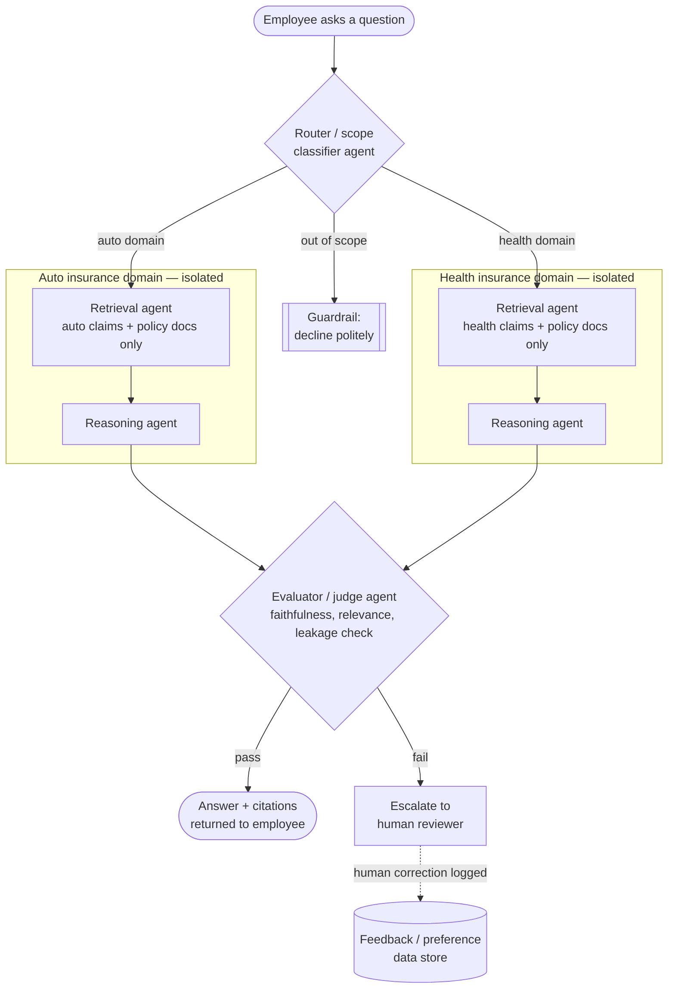
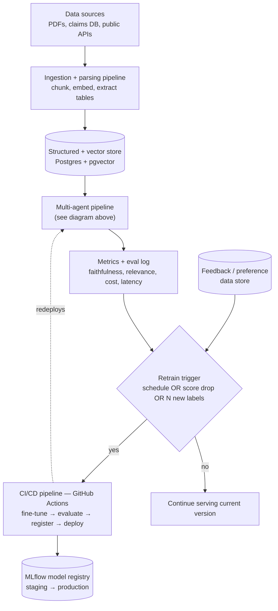

# Domain-Isolated Multi-Agent Q&A System for Regulated Financial Data

A self-evaluating, multi-agent question-answering system for internal employees in banking and insurance,
built and documented as an MSc capstone project. It answers questions over heterogeneous data (PDF policy
documents, claims databases, filings) while enforcing strict data isolation between business lines and
scoring every answer for accuracy and groundedness before it is returned.

> **Case study domain:** an insurer with separate auto and health insurance lines. An employee's question is
> answered only from the data belonging to the relevant line, with an automated gate checking correctness
> before the answer ever reaches them.

---

## Table of contents

1. [Why this project](#why-this-project)
2. [What this is *not*](#what-this-is-not)
3. [Architecture](#architecture)
4. [Tech stack](#tech-stack)
5. [Data](#data)
6. [Evaluation](#evaluation)
7. [Repository structure](#repository-structure)
8. [Quickstart](#quickstart)
9. [Roadmap](#roadmap)
10. [Limitations & open questions](#limitations--open-questions)
11. [Acknowledgments & licenses](#acknowledgments--licenses)

---

## Why this project

Employees at financial institutions routinely need answers that require reading across long documents,
structured records, and multiple systems — and getting it wrong has real cost. Two problems compound this:

- **Retrieval-augmented generation is not a solved problem in finance.** On FinanceBench, a 10,231-question
  benchmark over public company disclosures, even GPT-4-Turbo with retrieval answered incorrectly or refused
  more than 80% of the time. Grounding matters more than model size here.
- **Most internal-tool projects treat "isolation" as an access-control afterthought.** In a real insurer,
  an employee's question about an auto claim should never be answerable using health data, even
  accidentally, even by a well-intentioned agent with broad tool access. This project treats that boundary
  as a first-class architectural constraint, not a prompt instruction.

This repo is deliberately scoped as **an engineered system, not a prompt wrapper**: it fine-tunes an
open-weight model rather than only calling a hosted API, builds its own extensible evaluation harness rather
than eyeballing outputs, and is versioned and gated the way a production service would be.

## What this is *not*

- **Not** a HIPAA- or GLBA-compliant production system. It uses public and synthetic data and is a portfolio
  simulation of the *architecture* such a system would need — see [Limitations](#limitations--open-questions).
- **Not** a general-purpose chatbot. Out-of-scope questions are meant to be refused, not answered helpfully.
- **Not** dependent on a single vendor API — every component is open source and self-hostable.

---

## Architecture

### Query-time flow: routing, isolation, and the evaluation gate



The router never reads claim or policy content itself — it classifies on metadata and question phrasing
only, so the component with the widest exposure has the least access. The two domain subgraphs share no
code path or memory at runtime; each is a separately scoped retriever + reasoner pair with its own database
connection and its own system prompt. The evaluator agent sees the full trace (question, retrieved chunks,
reasoning, draft answer), not just the final text, so it can catch a bad handoff even when the final answer
reads fluently.

### System lifecycle: continuous ingestion, evaluation, and retraining



This is the part that makes "gets better over time" literal rather than aspirational: every answer is
scored and logged, every human correction on an escalated case becomes labeled training data, and a defined
trigger condition — not a manual decision — determines when a new fine-tuning run kicks off.

---

## Tech stack

| Layer | Tool | Why this one |
|---|---|---|
| Agent orchestration | [LangGraph](https://github.com/langchain-ai/langgraph) | stateful graph model, built-in checkpointing, human-in-the-loop primitives |
| Orchestration comparison | [CrewAI](https://github.com/crewAIInc/crewAI) | built once in parallel for a documented framework comparison |
| Storage | PostgreSQL + [pgvector](https://github.com/pgvector/pgvector) | structured claims data and embeddings in one database, queryable with SQL joins |
| Storage comparison | [Qdrant](https://github.com/qdrant/qdrant) | benchmarked against pgvector for latency/recall at scale |
| Fine-tuning | Hugging Face `transformers` + `peft` + `trl`, [Unsloth](https://github.com/unslothai/unsloth) | QLoRA on a single consumer/rented GPU, ~$10-15 per run |
| Guardrails | fine-tuned scope classifier + [Semantic Router](https://github.com/aurelio-labs/semantic-router) | rejects out-of-scope questions before any retrieval runs |
| Evaluation | [RAGAS](https://github.com/explodinggym/ragas), [DeepEval](https://github.com/confident-ai/deepeval) | pluggable metric interface; DeepEval covers multi-turn conversational eval |
| Observability | [Arize Phoenix](https://github.com/Arize-ai/phoenix) or [Langfuse](https://github.com/langfuse/langfuse) | span-level tracing across agent hops, not just an aggregate score |
| Model registry | [MLflow](https://github.com/mlflow/mlflow) | experiment tracking, versioning, staging → production promotion |
| Data versioning | [DVC](https://github.com/iterative/dvc) | ties every eval run to an exact dataset commit |
| CI/CD | GitHub Actions | test → eval gate → fine-tune-eval delta check → registry promotion → deploy |
| Serving | FastAPI + Docker | containerized API, not a notebook |
| Demo UI | Streamlit or Gradio | live, clickable demo |

---

## Data

No real bank or insurer data is used anywhere in this project. Everything is public, academic, or clearly
labeled synthetic.

| Type | Source | Notes |
|---|---|---|
| Structured auto claims | Kaggle auto insurance claims datasets | tabular; verify individual dataset license before any redistribution |
| Structured health claims | Kaggle health insurance datasets | tabular; same license caveat |
| Financial document QA | FinQA, ConvFinQA, TAT-QA | academic benchmarks; ConvFinQA specifically covers multi-turn, context-dependent questions and is the basis for the follow-up-question eval set |
| Growing document corpus | SEC EDGAR public API | free, no auth, used to simulate a corpus that keeps expanding |
| Health policy documents | CMS.gov public plan documents (Evidence of Coverage, Summary of Benefits) | real public-domain documents, not claims data |
| Synthetic fill-in data | Generated via an open-weight LLM | used only where public data doesn't cover a needed case; always tagged `source: synthetic` in metadata, never mixed silently with real records |

---

## Evaluation

Metrics are implemented behind a common interface (`src/eval/metrics/base.py`) so new ones can be added
without touching the harness. Initial set:

| Metric | Checks | Implementation |
|---|---|---|
| Faithfulness | Is the answer grounded in retrieved context | RAGAS / DeepEval |
| Answer relevance | Does the answer address the question asked | RAGAS / DeepEval |
| Context precision / recall | Did retrieval surface the right chunks | RAGAS |
| Cross-domain leakage | Did an auto-domain answer cite health data, or vice versa | custom |
| Multi-turn coherence | Does a follow-up correctly resolve references to prior turns | DeepEval `ConversationalTestCase` |
| Scope adherence | Did the guardrail correctly accept/reject the question | custom, against a held-out labeled set |
| Cost per query | Token + compute cost | custom, logged per call |
| Latency (p50 / p95) | End-to-end response time | custom, logged per call |

Every model change (fine-tune, prompt edit, retrieval config change) is run against a fixed golden set before
merge, and the GitHub Actions workflow fails the build if faithfulness or scope-adherence drops below a
defined threshold.

---

## Repository structure

```
.
├── src/
│   ├── ingestion/        # parsers for PDF, CSV, DB sources; chunking + embedding
│   ├── agents/            # router, retrieval, reasoning, evaluator agents (LangGraph)
│   ├── guardrails/        # scope classifier, injection checks
│   ├── eval/
│   │   └── metrics/       # pluggable metric implementations
│   ├── finetune/          # LoRA/QLoRA training scripts, eval-before/after harness
│   └── api/                # FastAPI app
├── data/
│   ├── raw/
│   ├── processed/
│   └── synthetic/
├── notebooks/              # exploratory analysis, not production code
├── tests/                  # unit + integration tests
├── .github/workflows/      # CI/CD pipelines
├── docker/
├── docs/                   # design decisions, eval reports
├── requirements.txt
├── LICENSE
└── CHANGELOG.md
```

## Quickstart

```bash
git clone <repo-url>
cd <repo-name>
cp .env.example .env          # set DB creds, HF token, etc.
docker compose up -d          # Postgres+pgvector, API, (optional) local model server
python -m src.ingestion.run   # populate the store from data/raw
uvicorn src.api.main:app --reload
```

Full setup instructions will live in `docs/setup.md` as the pipeline is built out.

---

## Roadmap

- [ ] Single-domain RAG pipeline (auto insurance) working end to end into pgvector
- [ ] Second domain (health) + router/isolation layer
- [ ] Baseline evaluation harness against the un-fine-tuned open model
- [ ] LoRA/QLoRA fine-tune + before/after comparison on the same eval set
- [ ] Scope/off-topic guardrail classifier, evaluated on a held-out set
- [ ] Multi-turn context handling, evaluated on ConvFinQA-style follow-ups
- [ ] Observability/tracing layer wired into the agent pipeline
- [ ] Human-feedback capture on escalated cases → preference dataset
- [ ] CI/CD: GitHub Actions eval gate, MLflow registry, Docker build
- [ ] Cost + latency tracking dashboard
- [ ] Second open-weight model fine-tuned and compared against the first
- [ ] Write-up: architecture, eval results, data lineage, limitations

## Limitations & open questions

Documented deliberately rather than discovered by a reviewer:

- **Not regulator-compliant.** No real PII, no HIPAA/GLBA controls implemented — the isolation and
  access-control patterns are demonstrated architecturally, not certified.
- **Prompt-injection defense is planned, not yet built.** Ingested documents are untrusted input; a
  malicious or malformed PDF could attempt to steer agent behavior. This needs its own guardrail and its own
  eval set, separate from the off-topic classifier.
- **No statistical rigor yet on fine-tuning comparisons.** Before/after evals are currently single runs;
  ideally these are repeated across seeds before any "improved by X%" claim is treated as solid.
- **Dataset licenses need a per-source audit** before any derived artifact (fine-tuned weights, processed
  corpora) is published — academic QA datasets and Kaggle datasets carry different terms.
- **Single-tenant, no auth/SSO** — this is a research/demo deployment, not a multi-user production service.
- **Retraining trigger thresholds are placeholders** until there's enough logged traffic to set them
  empirically rather than by guess.

## Acknowledgments & licenses

This project is built entirely on open-source software and public/academic datasets. Code in this repo is
released under the MIT License (see `LICENSE`). Datasets and benchmarks retain their original licenses —
see `docs/data-sources.md` for source-by-source terms once populated. Key open-source projects and datasets
this work builds on: LangGraph, pgvector, Qdrant, Hugging Face `transformers`/`peft`/`trl`, Unsloth, RAGAS,
DeepEval, MLflow, DVC, and the FinQA / ConvFinQA / TAT-QA research datasets.
